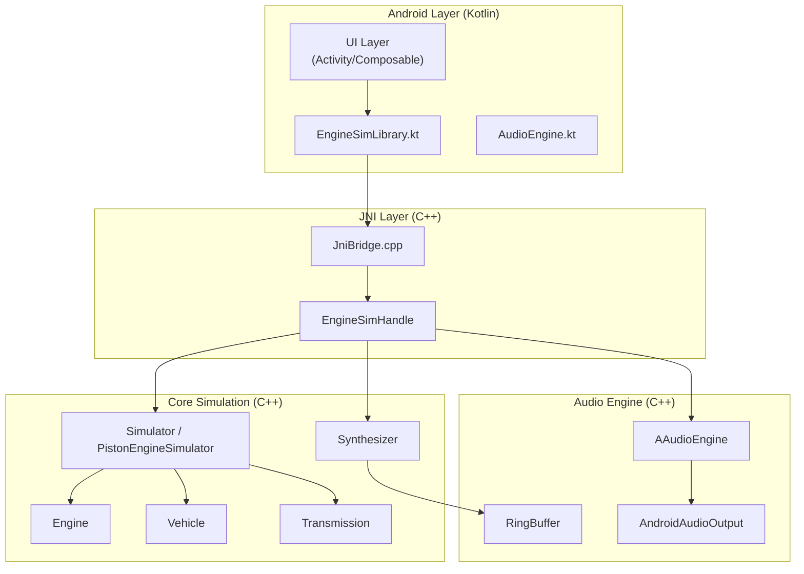
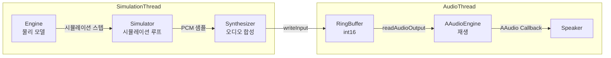
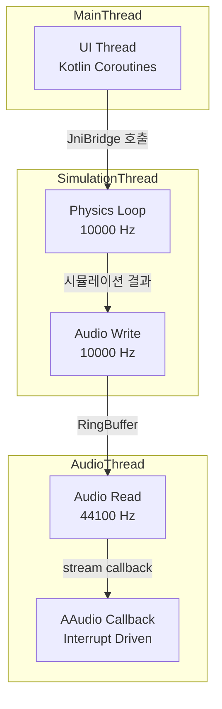
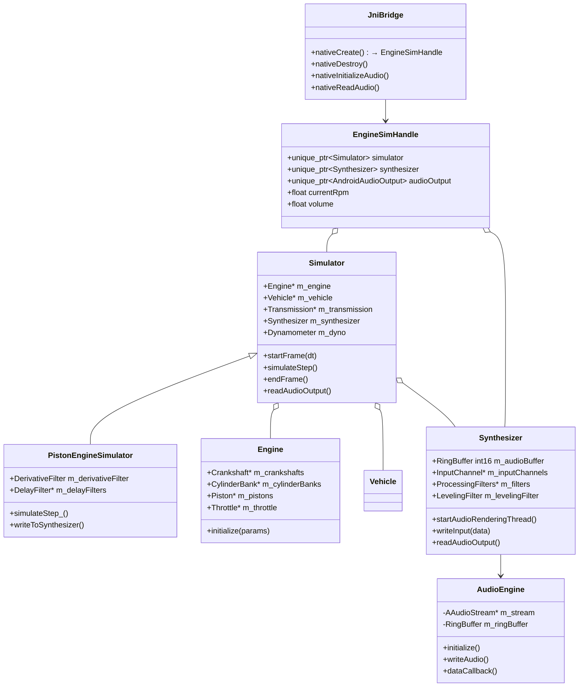
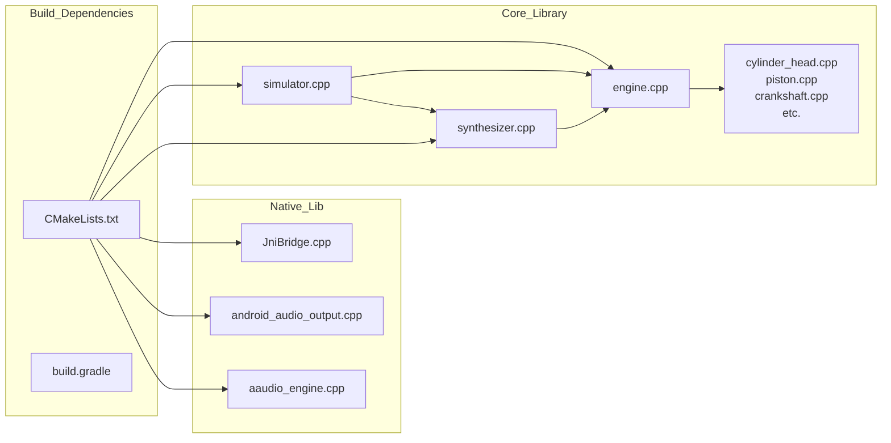
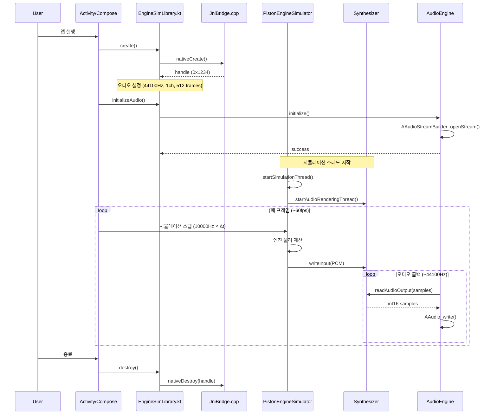
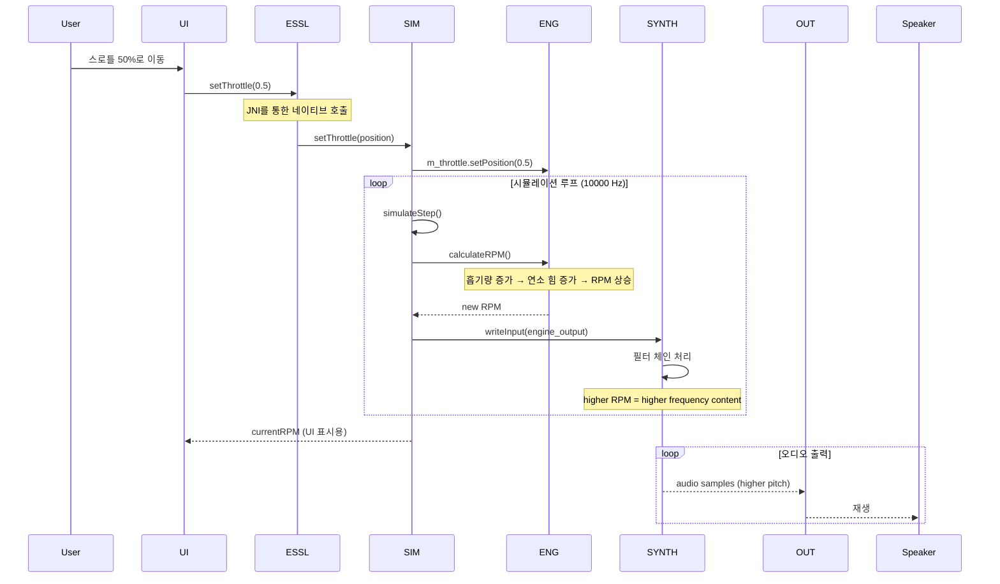
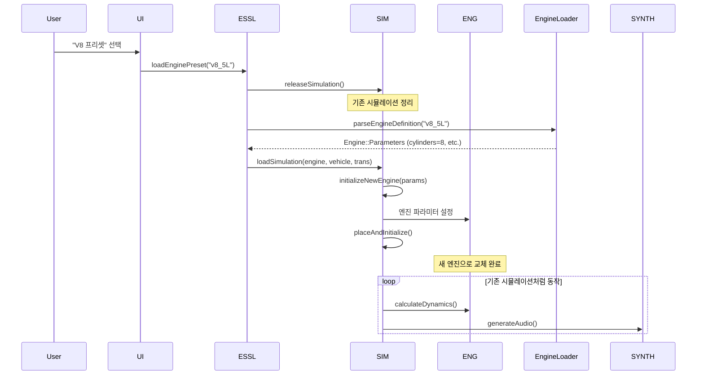
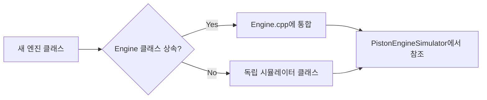

# Engine-Sim Android Architecture

문서 작성일: 2026-05-07
프로젝트: engine-sim-android

---

## 1. 전체 시스템 아키텍처



### 계층 설명

| 계층 | 기술 | 역할 |
|------|------|------|
| **UI Layer** | Kotlin/Jetpack Compose | 사용자 인터페이스, RPM 표시, 컨트롤 |
| **EngineSimLibrary** | Kotlin | JNI 래퍼, 오디오 버퍼 관리 |
| **AudioEngine** | Kotlin | AAudio 플레이백 오케스트레이션 |
| **JniBridge** | C++ | JNI 메소드 구현, 네이티브 핸들 관리 |
| **Simulator** | C++ | 물리 시뮬레이션 메인 루프, 물리 계산 |
| **Synthesizer** | C++ | 오디오 신호 처리 (필터 체인) |
| **AAudioEngine** | C++ | Android AAudio API 래핑 |
| **Engine/Vehicle** | C++ | 엔진 및 차량 물리 모델 |

---

## 2. 데이터 흐름도

### 시뮬레이션 → 오디오 데이터 흐름



### 주요 데이터 변환

```
Engine Physics (10000 Hz)
    → Engine RPM / Torque
    → Synthesizer Input (Upsampling)
    → Audio Buffer (44100 Hz, int16)
    → AAudio Stream
    → Device Speaker
```

---

## 3. 스레드 모델



### 스레드 상세

| 스레드 | 태스크 | 주기 | 우선순위 |
|--------|--------|------|----------|
| **Main Thread** | UI 업데이트, JNI 호출 | 불규칙 | Normal |
| **Simulation Thread** | 엔진 물리 시뮬레이션 | 10000 Hz | High |
| **Audio Write** | Synthesizer에 샘플 쓰기 | 10000 Hz | High |
| **Audio Thread** | RingBuffer → AAudio | 44100 Hz | High (Real-time) |
| **AAudio Callback** | 하드웨어 인터럽트 | 가변 | Highest |

---

## 4. 핵심 클래스 다이어그램



---

## 5. 의존성 그래프



---

## 6. 빌드 파이프라인

```
┌─────────────────────────────────────────────────────────────────┐
│                      Android Build                              │
├─────────────────────────────────────────────────────────────────┤
│                                                                 │
│  1. CMake Configuration (app/src/main/cpp/CMakeLists.txt)      │
│     └── Finds/links engine_sim core (core/CMakeLists.txt)      │
│                                                                 │
│  2. Core Library Build (core/)                                  │
│     ├── engine_sim/core/src/engine_sim/*.cpp                    │
│     ├── Compile to static libengine_sim.a                      │
│     └── Dependencies: scs (rigid body physics)                  │
│                                                                 │
│  3. JNI Library Build (app/src/main/cpp/)                       │
│     ├── JniBridge.cpp                                          │
│     ├── aaudio_engine.cpp                                      │
│     ├── android_audio_output.cpp                              │
│     └── Link: engine_sim + AAudio + log                        │
│                                                                 │
│  4. Kotlin Build                                               │
│     ├── EngineSimLibrary.kt → JNI calls                        │
│     ├── AudioEngine.kt → audio playback                       │
│     └── Compiled into classes.dex                             │
│                                                                 │
│  5. APK Assembly                                               │
│     └── APK = classes.dex + libengine_sim_jni.so              │
│                                                                 │
└─────────────────────────────────────────────────────────────────┘
```

### CMakeLists.txt 구조

```
app/src/main/cpp/
├── CMakeLists.txt          # 메인 빌드 (links core)
├── JniBridge.cpp           # JNI bridge
├── aaudio_engine.cpp       # AAudio wrapping
├── android_audio_output.h/cpp
└── core/                   # (symlink 또는 prebuilt)
    └── libengine_sim.a    # 정적 라이브러리
```

---

## 7. 시퀀스 다이어그램

### 7.1 앱 시작 → 엔진 로드 → 오디오 재생



### 7.2 스로틀 변경 → RPM 변화 → 소리 변화



### 7.3 엔진 프리셋 전환



---

## 8. 레이어별 상세 설명

### 8.1 Core Layer (`engine_sim` 네임스페이스)

**위치**: `core/src/engine_sim/`

| 클래스 | 파일 | 설명 |
|--------|------|------|
| `Simulator` | simulator.cpp | 시뮬레이션 메인 orchestrator |
| `PistonEngineSimulator` | piston_engine_simulator.cpp | 피스톤 엔진 특화 시뮬레이션 |
| `Engine` | engine.cpp | 엔진 물리 모델 (크랭크샤프트, 실린더 뱅크 등) |
| `Synthesizer` | synthesizer.cpp | 오디오 신호 처리 및 필터 체인 |
| `Vehicle` | vehicle.cpp | 차량 역학 (마찰, 질량) |
| `Transmission` | transmission.cpp | 변속기 모델 |
| `Dynamometer` | dynamometer.cpp | 동력 측정기 |
| `Throttle` | throttle.cpp | 스로틀 밸브 모델 |
| `Crankshaft` | crankshaft.cpp | 크랭크샤프트 물리 |
| `Piston` | piston.cpp | 피스톤 물리 |
| `CylinderHead` | cylinder_head.cpp | 실린더 헤드 (흡기/배기) |

**핵심 시뮬레이션 루프**:
```cpp
void PistonEngineSimulator::simulateStep_() {
    // 1. 물리 시뮬레이션 스텝 ( SCS 라이브러리 )
    m_system->step(m_timestep);

    // 2. 엔진 상태 업데이트
    for each cylinder:
        calculateCombustion();
        updatePistonPosition();

    // 3. 오디오 합성기에 입력
    writeToSynthesizer();
}
```

### 8.2 JNI Layer (`JniBridge.cpp`)

**위치**: `android/app/src/main/cpp/`

`EngineSimHandle` 구조체가 핵심:
```cpp
struct EngineSimHandle {
    std::unique_ptr<engine_sim::Simulator> simulator;
    std::unique_ptr<engine_sim::Synthesizer> synthesizer;
    std::unique_ptr<engine_sim::AndroidAudioOutput> audioOutput;
    float currentRpm = 0.0f;
    float volume = 1.0f;
};
```

**JNI 메소드**:
- `nativeCreate()` → 핸들 생성
- `nativeDestroy(handle)` → 리소스 해제
- `nativeInitializeAudio(handle, sr, ch, buf)` → 오디오 초기화
- `nativeSetVolume(handle, vol)` → 볼륨 설정
- `nativeGetRpm(handle)` → 현재 RPM 조회
- `nativeReadAudio(handle, buffer, samples)` → 오디오 버퍼 읽기

### 8.3 Kotlin Layer

**EngineSimLibrary.kt** (`com.enginesim.app`)
- JNI 메소드 래핑
- 오디오 버퍼 관리
- 네이티브 라이브러리 로딩 (`engine_sim_jni`)

**AudioEngine.kt** (`com.enginesim.app`)
- AAudio 스트림 관리
- 콜백 기반 오디오 재생
- RingBuffer 연동

### 8.4 Audio Layer

**AAudioEngine** (`aaudio_engine.cpp`)
- AAudioStreamBuilder 패턴
- 데이터 콜백 모드 (논블로킹)
- 低遅延 스트림 설정 (LOW_LATENCY 모드)

**RingBuffer**
- 시뮬레이션 스레드 ↔ 오디오 스레드 간 통신
- Lock-free 구조 (원칙적으로)
- 크기: `RING_BUFFER_FRAMES * channels`

---

## 9. 확장 포인트

### 9.1 새 엔진 타입 추가



**방법 1 - Engine 클래스 확장** (권장):
1. `core/include/engine_sim/engine.h`에 새 파라미터 추가
2. `core/src/engine_sim/engine.cpp`에 초기화 로직 추가
3. 프리셋 JSON에 새 파라미터 정의

**방법 2 - 독립 시뮬레이터**:
1. `PistonEngineSimulator` 상속 또는 새 클래스 작성
2. `Simulator` 인터페이스 구현
3. JNI 레이어에서 새 시뮬레이터 사용

### 9.2 새 오디오 필터 추가

`Synthesizer::ProcessingFilters`에 필터 추가:

```cpp
struct ProcessingFilters {
    ConvolutionFilter convolution;
    DerivativeFilter derivative;
    JitterFilter jitterFilter;
    ButterworthLowPassFilter<float> airNoiseLowPass;
    LowPassFilter inputDcFilter;
    ButterworthLowPassFilter<double> antialiasing;
    // 👇 새 필터 추가
    MyNewFilter myNewFilter;
};
```

### 9.3 새 플랫폼 지원

현재: Android (AAudio)
추가 가능: iOS (AudioUnit), Desktop (WASAPI/PulseAudio)

**인터페이스 활용**:
```
Simulator.readAudioOutput()  →  AudioOutputInterface  ←  플랫폼별 구현
```

플랫폼별 구현:
- Android: `AndroidAudioOutput` (AAudio)
- iOS: `IOSAudioOutput` (AudioUnit)
- Desktop: `DesktopAudioOutput` (WASAPI/PulseAudio)

---

## 10. 파일 구조 요약

```
engine-sim-android/
├── PROGRESS.md
├── android/
│   └── app/
│       └── src/
│           ├── main/
│           │   ├── cpp/
│           │   │   ├── CMakeLists.txt
│           │   │   ├── JniBridge.cpp/h         # JNI 브릿지
│           │   │   ├── aaudio_engine.cpp/h     # AAudio 래퍼
│           │   │   ├── android_audio_output.h  # 오디오 출력 인터페이스
│           │   │   └── engine_sim_jni.cpp/h    # JNI 라이브러리
│           │   └── java/
│           │       └── com/enginesim/app/
│           │           ├── EngineSimLibrary.kt  # Kotlin JNI 래퍼
│           │           └── AudioEngine.kt      # 오디오 플레이백
│           └── build.gradle
├── core/
│   ├── CMakeLists.txt
│   ├── include/
│   │   └── engine_sim/
│   │       ├── simulator.h
│   │       ├── engine.h
│   │       ├── synthesizer.h
│   │       ├── audio_buffer.h
│   │       └── ... (50+ 헤더)
│   └── src/
│       └── engine_sim/
│           ├── simulator.cpp
│           ├── engine.cpp
│           ├── synthesizer.cpp
│           ├── piston_engine_simulator.cpp
│           └── ... (50+ 소스)
├── docs/
│   └── ARCHITECTURE.md  # 이 문서
└── build/               # Gradle 빌드 출력
```

---

## 11. 빌드 의존성

```
app/build.gradle
    └── implementation ':engine_sim' (CMake)

core/CMakeLists.txt
    └── target_link_libraries(engine_sim scs)
         scs = rigid body physics library (atg_scs)

android/app/src/main/cpp/CMakeLists.txt
    └── target_link_libraries(engine_sim_jni
                              engine_sim
                              aaudio
                              log)
```

---

*문서 생성일: 2026-05-07*
*generated for engine-sim-android project*